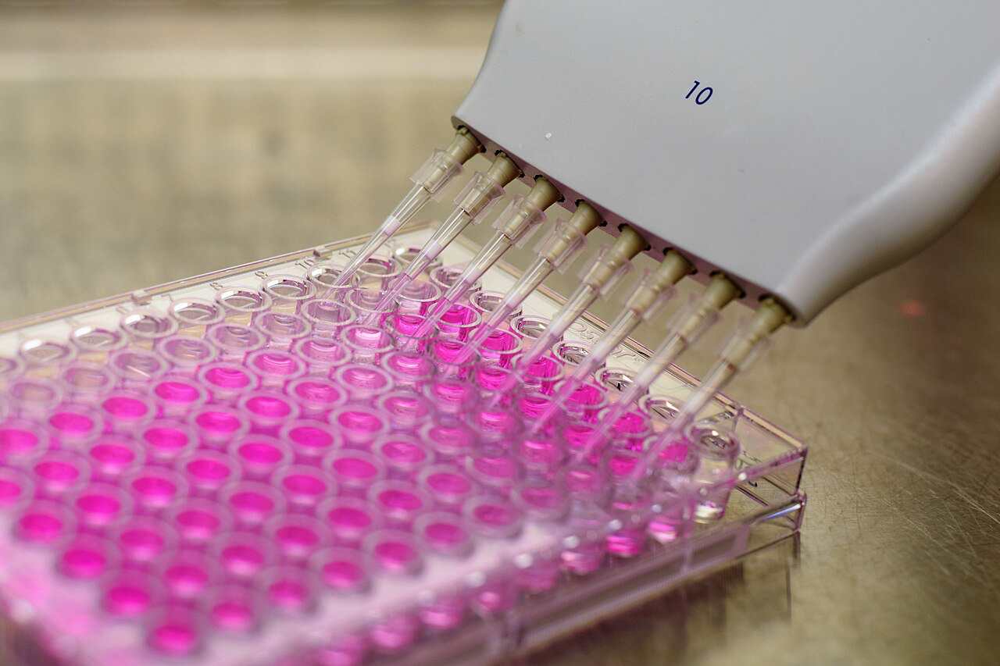
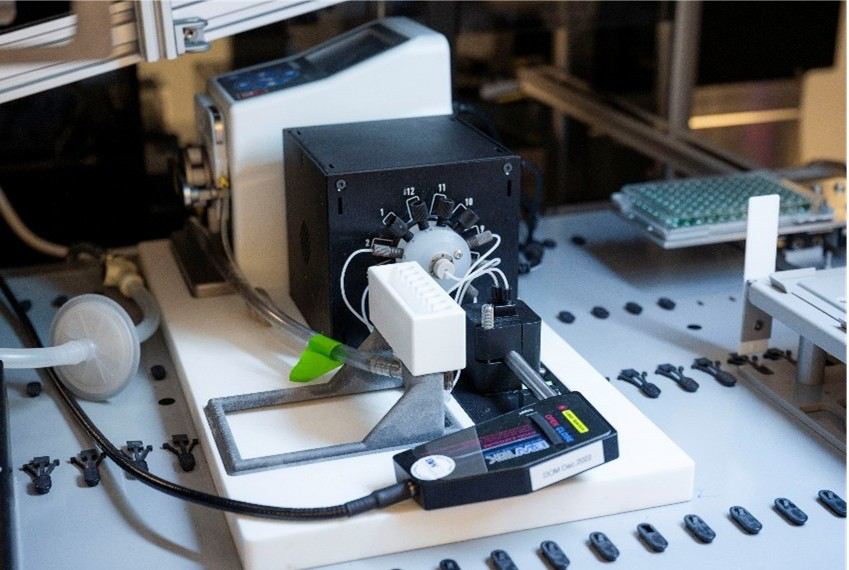

# Dig4Bio

Kaggle project workspace for the Dig4Bio Raman transfer learning challenge. The project focuses on predicting the concentrations of glucose, acetate, and magnesium sulfate from Raman spectra collected across different measurement setups.

https://www.kaggle.com/competitions/dig-4-bio-raman-transfer-learning-challenge

## Problem Statement

Raman spectroscopy offers a powerful, label-free way to characterise the chemical composition of biological and chemical samples. However, models trained on Raman spectra from one device often fail to generalise across instruments from different vendors due to subtle differences in hardware and signal processing. This challenge asks for machine learning approaches that utilise information derived from Raman spectra in different measurement setups to predict concentrations of three analytes - glucose, acetate, and magnesium sulfate - which are commonly found in bioprocess samples. The goal is to build a machine learning model that generalises across multiple Raman devices and can adapt to a new measurement setup with minimal additional data.

## Data


<table>
  <tr>
    <td align="center"></td>
    <td align="center"></td>
  </tr>
  <tr>
    <td align="center"><strong>96-well plate</strong></td>
    <td align="center"><strong>Multiplexer</strong></td>
  </tr>
</table>

<sub>96-well plate photo: J.N. Eskra, [Wikimedia Commons](https://commons.wikimedia.org/wiki/File:96_well_plate.jpg), [CC BY-SA 4.0](https://creativecommons.org/licenses/by-sa/4.0/).</sub>

A **sample** is one small container of liquid. Glucose, acetate, and magnesium sulfate are dissolved together in that liquid, with a known concentration for each substance. For example, one sample might contain 5 g/L of glucose, 1 g/L of acetate, and 2 g/L of magnesium sulfate. Another sample has a different recipe, and a concentration of zero means that substance is absent.

A Raman spectrometer shines a laser on one sample and records a **spectrum**. The spectrum acts like a chemical fingerprint: its shape depends on what is in the liquid and how much of each substance is present. One spectrum is one reading from one instrument.

The experiment produced three groups of data:

- **Source data:** the researchers prepared many known recipes and measured overlapping selections of them using eight different Raman spectrometers. Some recipes appear in all eight device datasets, while others were measured by only some devices. The source data come from a study by [Lange et al.](https://doi.org/10.1016/j.saa.2025.125861).
- **Calibration data:** the researchers prepared 96 new samples and placed one sample in each well of a 96-well plate. The concentration of each substance is known. The plate was measured using the target setup: an automated multiplexer connected to a Raman spectrometer. Each well was scanned twice, producing two spectra for the same sample.
- **Test data:** the researchers prepared a second plate containing another 96 samples and measured it with the target multiplexer setup. Each well was again scanned twice, but the concentrations are hidden. The competition task is to predict the three concentrations for each sample.

For reference, the target multiplexer setup uses a Metrohm i-Raman Plus 785 spectrometer. Each spectrum contains 2,048 measurements covering a range from 65 cm⁻¹ to 3,350 cm⁻¹. Further technical details are available in the accompanying [preprint](https://arxiv.org/abs/2504.11234).

## Project Structure

```text
data/                  # Raw, interim, and processed datasets
notebooks/             # Exploration, visual checks, debugging, and error analysis
docs/                  # Project notes, decisions, assumptions, and conventions
src/dig4bio/           # Reusable Python package code
configs/experiments/   # Editable experiment configs
experiments/           # Experiment plans, notes, and run outputs
results/               # Global result summaries
```

See `docs/project_structure.md` for the folder conventions and experiment/run structure.

## Package Setup

Install the project package in editable mode from the project root:

```bash
python -m pip install -e .
```

Then notebooks, CLI commands, and experiment code can import reusable functionality from `dig4bio`:

```python
from dig4bio.utils import read_raman_file
```

## Command Line Usage

After installing the package in editable mode, these commands are available:

| Command | Description |
| ------- | ----------- |
| `clean-transfer-plate` | Create the interim transfer plate dataset. |
| `clean-test-samples` | Create the interim 96-sample test dataset. |
| `clean-8-devices` | Create interim datasets for the eight source devices. |
| `clean-all-data` | Create all interim datasets. |
| `make-eda-figures` | Create all data analysis figures/plots |
