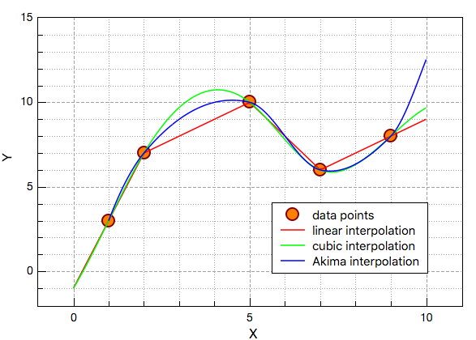

# Wavenumber Interpolation

The datasets use different wavenumber ranges and sampling intervals. A model cannot combine spectra from different devices until every row is represented on the same set of spectral columns.

## Dataset Wavenumber Coverage

| Dataset | Min cm⁻¹ | Max cm⁻¹ | Median spacing | Notes |
| ------- | -------: | -------: | -------------: | ----- |
| anton532 | 200.00 | 3500.00 | 2.00 | Source device |
| anton785 | 100.00 | 2300.00 | 2.00 | Source device |
| kaiser | -36.30 | 1941.30 | 0.30 | Source device; narrowest upper range |
| metrohm | 202.22 | 3349.39 | 1.60 | Source device; uneven grid |
| mettler | 300.00 | 3200.00 | 1.00 | Source device; highest lower bound |
| tec | 85.00 | 3210.00 | 1.00 | Source device |
| timegate | 200.93 | 1997.69 | 3.48 | Source device; uneven grid |
| tornado | 300.00 | 3300.00 | 1.00 | Source device |
| transfer_plate | 65.00 | 3350.00 | 1.00 | Target calibration data |
| 96_samples | 65.00 | 3350.00 | 1.00 | Target test data |

The common overlap across all datasets is approximately **300 to 1941 cm⁻¹**. Using this shared range would avoid extrapolating beyond any device's measured region, but it would also discard higher-wavenumber information available in most datasets.

For example, the source devices do not just differ in range; they also use different grid points:

| Dataset | First six wavenumbers |
| ------- | --------------------- |
| anton532 | `200.00, 202.00, 204.00, 206.00, 208.00, 210.00` |
| metrohm | `202.22, 204.59, 206.96, 209.32, 211.69, 214.06` |

The spectra therefore need to be interpolated onto a common grid before they can be combined.

Linear interpolation can be performed to 'generate' points between two ground truth wavenumbers. As can be seen in the image above, different interpolation functions can be used to generate these new points.

Looking at research papers online, linear interpolation is often a good enough method due to Raman spectra being densely sampled anyway. If performance on the more sparsely sampled datasets is lower, perhaps this can be reevaluated.

## Implementation

There are two methods that are commonly used for interpolation:
- `numpy.interp`
- `scipy.interpolate.make_interp_spline`

The first is for linear interpolation only, and can also only handle one spectrum at a time. The latter, on the other hand, can use different interpolation functions and can handle many spectra in one function call.

## Mathematical Definition
### Linear Interpolation
For each spectrum $s$, `make_interp_spline(..., k=1)` joins neighbouring measured points with straight lines. For a new wavenumber $x$ between two original wavenumbers $x_j$ and $x_{j+1}$, $$ \hat{I}_s(x) = I_{s,j} + \frac{x-x_j}{x_{j+1}-x_j} \left(I_{s,j+1}-I_{s,j}\right). $$ 

Here:
- $I_{s,j}$ is the measured intensity at $x_j$
- $I_{s,j+1}$ is the measured intensity at $x_{j+1}$
- $\hat{I}_s(x)$ is the estimated intensity at the new wavenumber $x$

The fraction $$ \frac{x-x_j}{x_{j+1}-x_j} $$ describes how far $x$ lies between the two original wavenumbers.
